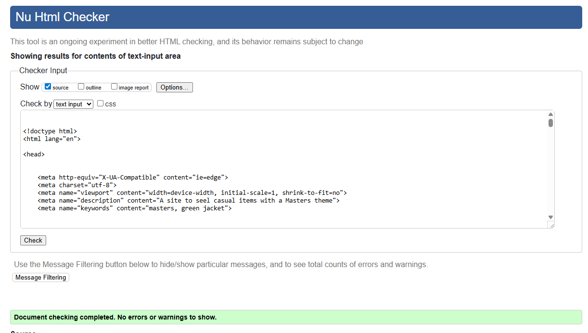
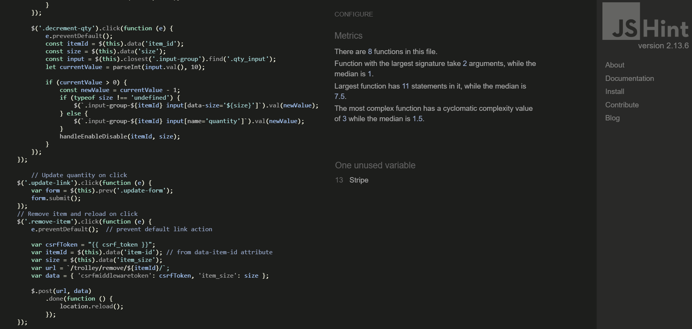
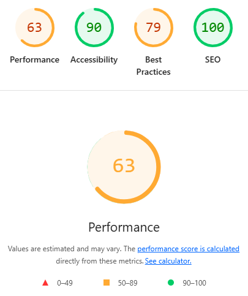

# Validating

Return back to the [README.md](README.md) file.

## Code Validation

### HTML

I have used the recommended [HTML W3C Validator](https://validator.w3.org) to validate all of my HTML files.

| Page | Screenshot | Notes |
| --- | --- | --- |
| Home/Index |  | Pass: No Errors |
| Items |  | Pass: No Errors |
| Items Edit Review|  | Pass: No Errors |
| Items Delete Review|  | Pass: No Errors |
| Items Edit Item|  | Pass: No Errors |
| Items Delete Item|  | Pass: No Errors |
| Items Add Item|  | Pass: No Errors |
| Trolley |  | Pass: No Errors |
| Who We Are |  | Pass: No Errors |
| Profile |  | Pass: No Errors |
| Register |  | Pass: No Errors |
| Login |  | Pass: No Errors |
| Item Details |  | Pass: No Errors |
| Edit Review |  | Pass: No Errors |
| Delete Review |  | Pass: No Errors |
| Logout |  | Pass: No Errors |
| Checkout |  | Pass: No Errors |
| Checkout Success |  | Pass: No Errors |
| Email |  | Pass: No Errors |
| Email confirm |  | Pass: No Errors |
| Password Change |  | Pass: No Errors |
| Password Reset Done |  | Pass: No Errors |
| Password Reset From Key Done |  | Pass: No Errors |
| Password Reset From Key |  | Pass: No Errors |
| Password Reset |  | Pass: No Errors |
| Verification Sent |  | Pass: No Errors |

### CSS

I have used the recommended [CSS Jigsaw Validator](https://jigsaw.w3.org/css-validator) to validate all of my CSS files.

| File | Screenshot | Notes |
| --- | --- | --- |
| base.css |  | Pass: No Errors |
| checkout.css |  | Pass: No Errors |

### JavaScript

I have used the recommended [JShint Validator](https://jshint.com) to validate all of my JS files.

| File | Screenshot | Notes |
| --- | --- | --- |
| stripe_elements.js |  | Pass: No Errors |
| save-toggle-script.js |  | Pass: No Errors |
| quantity-input.js |  | Pass: No Errors |

### Python

I have used the recommended [PEP8 CI Python Linter](https://pep8ci.herokuapp.com) to validate all of my Python files.

#### Validation For Green_Jacket App
| File | Screenshot | Notes |
| --- | --- | --- |
| settings.py |  | Pass: No Errors |
| asgi.py |  | Pass: No Errors |
| urls.py |  | Pass: No Errors |
| views.py |  | Pass: No Errors |
| wsgi.py |  | Pass: No Errors |

#### Validation For Checkout App
| File | Screenshot | Notes |
| --- | --- | --- |
| in_it.py |  | Pass: No Errors |
| admin.py |  | Pass: No Errors |
| apps.py |  | Pass: No Errors |
| forms.py |  | Pass: No Errors |
| models.py |  | Pass: No Errors |
| signals.py |  | Pass: No Errors |
| urls.py |  | Pass: No Errors |
| views.py |  | Pass: No Errors |
| webhook_handler.py |  | Pass: No Errors |
| webhooks.py |  | Pass: No Errors |

#### Validation For Clubhouse App
| File | Screenshot | Notes |
| --- | --- | --- |
| apps.py |  | Pass: No Errors |
| urls.py |  | Pass: No Errors |
| views.py |  | Pass: No Errors |

#### Validation For Items App
| File | Screenshot | Notes |
| --- | --- | --- |
| admin.py |  | Pass: No Errors |
| apps.py |  | Pass: No Errors |
| forms.py |  | Pass: No Errors |
| models.py |  | Pass: No Errors |
| urls.py |  | Pass: No Errors |
| views.py |  | Pass: No Errors |
| widgets.py |  | Pass: No Errors |

#### Validation For Profiles App
| File | Screenshot | Notes |
| --- | --- | --- |
| apps.py |  | Pass: No Errors |
| forms.py |  | Pass: No Errors |
| models.py |  | Pass: No Errors |
| urls.py |  | Pass: No Errors |
| views.py |  | Pass: No Errors |

#### Validation For Trolley App
| File | Screenshot | Notes |
| --- | --- | --- |
| trolley_tools.py |  | Pass: No Errors |
| apps.py |  | Pass: No Errors |
| context.py |  | Pass: No Errors |
| urls.py |  | Pass: No Errors |
| views.py |  | Pass: No Errors |

## Browser Compatibility

I've tested my deployed project on multiple browsers to check for compatibility issues.

| Browser | Screenshot | Notes |
| --- | --- | --- |
| Chrome |  | Works as expected |
| Firefox |  | Works as expected |

## Responsiveness

I've tested my deployed project on multiple devices to check for responsiveness issues.

| Device | Screenshot | Notes |
| --- | --- | --- |
| Mobile (DevTools) |  | Works as expected |
| Tablet (DevTools) |  | Works as expected |

## Lighthouse Audit

I've tested my deployed project using the Lighthouse Audit tool to check for any major issues.

### Green_Jacket Templates - Mobile Testing
| Page | Size | Screenshot | Notes |
| --- | --- | --- | --- |
| Home/Index | mobile |  |  |
| Items | mobile |  |  |
| Item Details | mobile |  |  |
| Item Image | mobile |  |  |
| Items Leave Review | mobile |  |  |
| Items Edit Review | mobile |  |  |
| Items Delete Review| mobile |  |  |
| Items Edit Item| mobile |  |  |
| Items Delete Item | mobile |  |  |
| Items Add Item | mobile |  |  |
| Who We Are | mobile |  |  |
| Profile | mobile |  |  |
| Register | mobile |  |  |
| Login | mobile |  |  |
| Edit Profile | mobile |  |  |
| Logout | mobile |  |  |
| Trolley | mobile |  |  |
| Checkout | mobile |  |  |
| Checkout Success | mobile |  |  |
| Email confirm | mobile |  |  |
| Verification Sent | mobile |  |  |
| Password Reset | mobile |  |  |
| Passeword Change| mobile |  |  |
| Password Confirm Change | mobile |  |  |
| 404 | mobile |  |  |
| Bad Token (from_key_token) | mobile |  |  |

[Back to Top](#top)